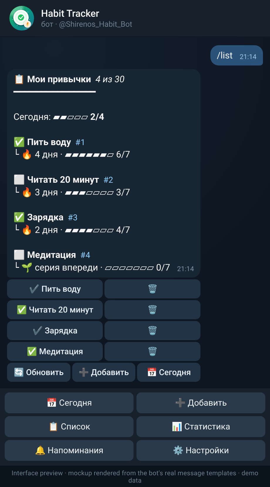
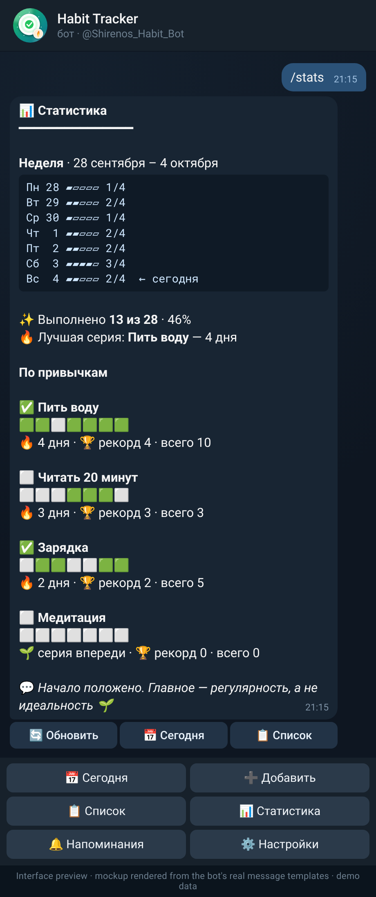

# 🌱 Habit Tracker Bot

A Telegram bot that helps you build habits, keep streaks alive and never forget a daily check-in.
The bot's user interface is in Russian (message strings and example output below are shown as the
bot really sends them; English glosses are added where useful).
Built with **aiogram 3**, **SQLite (aiosqlite)** and a tiny dependency-free **asyncio scheduler**.

[](https://github.com/Shirenos/habit-tracker-bot/actions/workflows/ci.yml)


[](https://docs.astral.sh/ruff/)
[](LICENSE)

<p align="center">
  
  &nbsp;&nbsp;
  
</p>

<p align="center"><sub><b>Interface preview</b> (mockup rendered from the bot's real message templates) —
<code>/list</code> and <code>/stats</code> with invented demo data. These are <b>not</b> real
screenshots of a Telegram chat; regenerate them with <code>python scripts/make_previews.py</code>.</sub></p>

**Try it:** [@Shirenos_Habit_Bot](https://t.me/Shirenos_Habit_Bot) on Telegram. The bot runs on the
owner's own machine, so it may be offline.

<details>
<summary><b>🇷🇺 Русская версия</b></summary>

### 🌱 Habit Tracker Bot — бот-трекер привычек

Telegram-бот, который помогает формировать привычки, держать серии («стрики») и не забывать про
ежедневную отметку. Интерфейс бота полностью на русском. Построен на **aiogram 3**, **SQLite
(aiosqlite)** и небольшом планировщике на `asyncio`.

> Картинки выше — это **макет интерфейса** (отрисован локально из настоящих шаблонов сообщений бота
> на выдуманных демо-данных), а не реальные скриншоты чата.

**Попробовать:** [@Shirenos_Habit_Bot](https://t.me/Shirenos_Habit_Bot). Бот работает на личном
компьютере владельца, поэтому может быть офлайн.

**Возможности**

- Личные привычки каждого пользователя: добавление, список, удаление (данные изолированы).
- Красивые карточки: эмодзи, полоски прогресса `▰▰▰▱▱` за день и за последние 7 дней, серии 🔥,
  подсказки до ближайшей отметки (3, 7, 14, 30 дней…), мотивирующие фразы.
- Меню внизу и inline-кнопки: ✅ отмечает привычку прямо в сообщении, 🗑 — удаление с
  подтверждением, 🔄 — обновление.
- Статистика: текущая и лучшая серия, всего отметок, недельная лента 🟩⬜ и график недели.
- Ежедневное напоминание (`/remind 21:30` или готовые пресеты); приходит только по невыполненным
  привычкам и переживает перезапуск.
- Часовой пояс настраивается (`TIMEZONE`), весь пользовательский ввод экранируется.
- Важно: напоминания, время которых пришлось на момент, когда бот был выключен, **пропускаются**
  (не досылаются после запуска). Часовой пояс один на всех пользователей (`TIMEZONE`);
  персональных поясов пока нет.

**Команды:** `/start`, `/menu`, `/today`, `/add <название>`, `/list`, `/done <номер>`, `/stats`,
`/remind ЧЧ:ММ` (`/remind off` — выключить), `/delete <номер>`, `/cancel`, `/help`.

**Быстрый старт**

```bash
# 1. создайте бота у @BotFather и скопируйте токен
cp .env.example .env            # впишите BOT_TOKEN и TIMEZONE (например, Europe/Moscow)

# 2a. запуск локально
python -m venv .venv && source .venv/bin/activate
pip install -r requirements.txt -e .
python -m habit_bot

# 2б. или через Docker
docker compose up -d --build
```

**Новое: администрирование, масштабирование и хостинг**

- `/admin` — панель администратора (только для Telegram ID из `ADMIN_IDS` в `.env`, остальным бот
  не отвечает): пользователи, активные за 7 дней, привычки, отметки за сегодня, размер БД.
- SQLite работает в режиме **WAL** (`synchronous=NORMAL`, `busy_timeout=5000`): для сотен
  пользователей такого бота этого достаточно; следующий шаг — PostgreSQL (см. раздел «Scaling»).
- Деплой на любой недорогой VPS: `docker compose up -d --build` (подробности — в разделе «Deploy»).
  Нужен сервер, с которого доступен Telegram.

Токен хранится только в `.env` (файл в `.gitignore`) и никогда не попадает в репозиторий.
Проверки: `pip install -r requirements-dev.txt -e . && ruff check . && pytest`.

</details>

## ✨ Features

- **Track habits** — add, list and delete personal habits (per-user, isolated).
- **Pretty cards** — Telegram HTML with emoji, a `▰▰▰▱▱` progress bar for the day and for each
  habit's last 7 days, 🔥 streaks with Russian plurals («1 день, 2 дня, 5 дней» — “1 day, 2 days, 5 days”), milestone hints
  («До 7 дней: ▰▰▰▱▱▱▱ 3/7»), motivating phrases and friendly empty states.
- **Menu & inline buttons** — a persistent bottom keyboard (Сегодня · Добавить · Список ·
  Статистика · Напоминания · Настройки — Today · Add · List · Stats · Reminders · Settings); a ✅ button under every open habit marks it done *in place*;
  🗑 asks for confirmation; 🔄 refreshes; all screens edit the message instead of spamming the chat.
- **Streaks & stats** — current streak, best streak, total, a 🟩⬜ week strip per habit and a text
  bar chart of the whole week.
- **Daily reminder** — pick a preset (08:00 · 12:00 · 18:00 · 21:00) or `/remind 21:30`; the
  reminder lists only the *unfinished* habits with ✅ buttons and stays silent when all are done.
  Reminders survive restarts.
  A reminder whose time passes while the bot is down is **skipped**, not sent after the restart.
- **Bot profile via Bot API** — name, descriptions, Russian command list and the menu button are
  applied by `python -m habit_bot.profile`; the command list is also refreshed on every start.
- **Timezone aware** — "today" and reminders follow a configurable IANA timezone. **One timezone
  is used for everyone** (`TIMEZONE`); per-user timezones are not supported yet.
- **Safe output** — all user input is HTML-escaped; length and count limits per user.
- **Admin panel** — an admin-only `/admin` command with usage stats (see [Admin panel](#-admin-panel)).
- **Production ready** — SQLite in WAL mode, Dockerfile (non-root) and docker-compose with a
  persistent volume, CI with ruff + mypy + pytest. See [Scaling](#-scaling) and [Deploy](#-deploy).

## 💬 Commands

| Command | Description |
| --- | --- |
| `/start` | Greeting and the bottom menu |
| `/menu` | Show the menu again |
| `/today` | Today's checklist with ✅ buttons |
| `/add <habit>` | Create a habit, e.g. `/add Пить воду` (“Drink water”; without a name — asks for it) |
| `/list` | All habits with streaks; ✅ / 🗑 buttons |
| `/done <id>` | Mark a habit as done today (without id — opens the checklist) |
| `/stats` | Week chart, streaks and records |
| `/remind HH:MM` | Daily reminder (24h). `/remind off` disables it; without args opens the panel |
| `/delete <id>` | Delete a habit and its history (asks for confirmation) |
| `/cancel` | Leave the "enter a habit name" dialog |
| `/help` | Help |
| `/admin` | Usage stats — **admins only** (IDs from `ADMIN_IDS`); silently ignored for everyone else |

## 🎨 Interface

The bottom keyboard gives one-tap access to everything; under each habit there is a ✅ button that
edits the message in place. The picture at the top is an interface preview (a mockup rendered from the bot's real message templates).
A text rendition of the output for demo data on Sunday 4 October 2026
(the real bot sends the same content as formatted Telegram HTML; no real chats are shown here):

`/list`

```text
📋 Мои привычки  4 из 30
━━━━━━━━━━━━━━━

Сегодня: ▰▰▱▱▱ 2/4

✅ Пить воду  #1
└ 🔥 4 дня · ▰▰▰▰▰▰▱ 6/7

⬜ Читать 20 минут  #2
└ 🔥 3 дня · ▰▰▰▱▱▱▱ 3/7

✅ Зарядка  #3
└ 🔥 2 дня · ▰▰▰▰▱▱▱ 4/7

⬜ Медитация  #4
└ 🌱 серия впереди · ▱▱▱▱▱▱▱ 0/7

[ ⬜→✅ Читать 20 минут ] [ 🗑 ]
[ ✔️ Пить воду ]  [ 🗑 ]      ← already done today
[ 🔄 Обновить ] [ ➕ Добавить ] [ 📅 Сегодня ]
```

`/stats`

```text
📊 Статистика
━━━━━━━━━━━━━━━

Неделя · 28 сентября – 4 октября
Пн 28 ▰▱▱▱▱ 1/4
Вт 29 ▰▰▱▱▱ 2/4
Ср 30 ▰▱▱▱▱ 1/4
Чт  1 ▰▰▱▱▱ 2/4
Пт  2 ▰▰▱▱▱ 2/4
Сб  3 ▰▰▰▰▱ 3/4
Вс  4 ▰▰▱▱▱ 2/4  ← сегодня
✨ Выполнено 13 из 28 · 46%
🔥 Лучшая серия: Пить воду — 4 дня

По привычкам

✅ Пить воду
🟩🟩⬜🟩🟩🟩🟩
🔥 4 дня · 🏆 рекорд 4 · всего 10

⬜ Читать 20 минут
⬜⬜⬜🟩🟩🟩⬜
🔥 3 дня · 🏆 рекорд 3 · всего 3

💬 Начало положено. Главное — регулярность, а не идеальность 🌱
```

> **Reading the examples:** `Мои привычки` = My habits, `Сегодня` = Today, `Статистика` =
> Statistics, `Неделя` = Week, `Пн Вт Ср Чт Пт Сб Вс` = Mon–Sun, `Пить воду` = Drink water, `Читать 20
> минут` = Read for 20 minutes, `Зарядка` = Morning exercise, `Медитация` = Meditation, `дня/дней` =
> days, `серия впереди` = streak ahead, `Обновить` = Refresh, `Добавить` = Add, `Лучшая серия` = Best
> streak, `рекорд` = record, `всего` = total, `Отличная работа!` = Great job!, `выполнено` = done,
> `новый рекорд!` = new record!, `До 7 дней` = To 7 days.

Marking a habit done (`/done 2` or the ✅ button):

```text
🎉 Отличная работа!
━━━━━━━━━━━━━━━

✅ Читать 20 минут — выполнено
🔥 4 дня · 🏆 новый рекорд!
🎯 До 7 дней: ▰▰▰▱▱▱▱ 4/7
```

## 🪪 Bot profile & avatar

Name, descriptions, the Russian command list and the menu button are set through the Bot API:

```bash
python -m habit_bot.profile        # reads BOT_TOKEN from the environment / .env, never prints it
```

`setMyName` is strictly rate-limited, so it is not called on every start (the command list and menu
button are refreshed automatically at startup). The avatar lives in `docs/avatar.png`
(1024×1024) and is generated by `scripts/make_avatar.py` (`pip install pillow`). The Bot API cannot
change a bot's photo — upload it via [@BotFather](https://t.me/BotFather) → `/setuserpic`.

## 🚀 Quickstart

1. Create a bot with [@BotFather](https://t.me/BotFather) and copy the token.
2. Configure the environment:

   ```bash
   cp .env.example .env
   # edit .env and set BOT_TOKEN (and TIMEZONE, e.g. Europe/Moscow)
   ```

### Run locally

```bash
python -m venv .venv && source .venv/bin/activate
pip install -r requirements.txt -e .
python -m habit_bot          # or: habit-bot
```

### Run with Docker

```bash
docker compose up -d --build
docker compose logs -f
```

The SQLite database lives in the `bot-data` volume, so data survives container rebuilds.
See [Deploy](#-deploy) for running it on a server.

### Configuration

| Variable | Default | Description |
| --- | --- | --- |
| `BOT_TOKEN` | — (required) | Telegram bot token from @BotFather |
| `DATABASE_PATH` | `data/habits.db` | SQLite file location |
| `TIMEZONE` | `UTC` | IANA timezone for "today" and reminders |
| `LOG_LEVEL` | `INFO` | Python logging level |
| `ADMIN_IDS` | empty | Comma-separated Telegram user IDs allowed to use `/admin` (e.g. `123456789,987654321`) |

> 🔐 Never commit `.env` — it is already in `.gitignore`.

## 🛠 Admin panel

Set `ADMIN_IDS` in `.env` to a comma-separated list of numeric Telegram user IDs (you can find yours
with [@userinfobot](https://t.me/userinfobot)) and restart the bot. Those users can send `/admin`
and get:

- total users (anyone with a habit or a reminder),
- active users in the last 7 days (at least one check-in),
- total habits,
- check-ins made today,
- the size of the database file (including its WAL file).

Everyone else is ignored silently — the bot does not reply to `/admin` at all — and the command is
not listed in `/help` or in the bot's command menu. With an empty `ADMIN_IDS` the panel is disabled.

## 📈 Scaling

The bot stores everything in **SQLite**, opened in **WAL** mode (`journal_mode=WAL`,
`synchronous=NORMAL`, `busy_timeout=5000`):

- Readers never block the writer and the writer does not block readers, so many users can check
  habits while others tick them off.
- A habit tracker is a tiny workload: a user produces a handful of small writes per day
  (a check-in is a single-row insert), and reminders are one lightweight asyncio task per user.
  SQLite in WAL mode comfortably handles thousands of writes per second on a cheap VPS, so
  **hundreds of users (and well beyond) are fine** — the bottleneck is the Telegram API rate
  limits, not the database.
- `busy_timeout` makes a writer wait up to 5 s for a lock instead of failing, and the schema is
  versioned (`PRAGMA user_version`) and migrated automatically on start.
- Back up by copying the database while the bot is stopped, or with `sqlite3 habits.db ".backup copy.db"`.

The storage layer sits behind a small interface (`habit_bot.storage.Storage`); services and
handlers never touch SQL. **When SQLite stops being enough** — several bot processes sharing one
database, webhook mode behind multiple workers, or tens of thousands of active users — the next
step is **PostgreSQL**: implement the same `Storage` interface on top of `asyncpg`/`psycopg` and
select it from the configuration. PostgreSQL is *not* implemented yet; today SQLite + WAL is the
only backend.

## 🌐 Deploy

The repository ships a `Dockerfile` (Python slim, runs as a non-root user, database in the
`/data` volume), a `docker-compose.yml` (`restart: unless-stopped`, `env_file: .env`, named data
volume) and a `.dockerignore`. Any cheap VPS (1 vCPU / 512 MB–1 GB RAM is plenty) with Docker is
enough.

> ⚠️ The bot talks to the Telegram Bot API (long polling), so the server must be able to reach
> `api.telegram.org`. Pick a host/region where Telegram is not blocked.

```bash
# on the server (with Docker + the Compose plugin installed)
git clone https://github.com/Shirenos/habit-tracker-bot.git
cd habit-tracker-bot
cp .env.example .env
nano .env                      # BOT_TOKEN, TIMEZONE, ADMIN_IDS
docker compose up -d --build   # build and start in the background
docker compose logs -f         # watch the logs
```

Useful commands:

```bash
docker compose ps                     # status
docker compose restart                # restart after editing .env
git pull && docker compose up -d --build   # update to a new version
docker compose down                   # stop (the data volume is kept; add -v to delete it!)
```

The container restarts automatically after a crash or a server reboot. Do not run the same bot
token in two places at once (e.g. locally and on the server) — Telegram only allows one polling
client per token. Only outbound connections are needed, so no ports have to be opened.

To back up the database from the volume:

```bash
docker compose stop
docker run --rm -v habit-tracker-bot_bot-data:/data -v "$PWD":/backup alpine \
  tar czf /backup/habits-backup.tgz -C /data .
docker compose start
```

(The volume name is `<project-folder>_bot-data`; check it with `docker volume ls`.)

## 🧪 Development

```bash
pip install -r requirements-dev.txt -e .
ruff check . && ruff format --check .
mypy
pytest
```

Tests cover the streak maths, the database layer, the service layer, reminders (including the
composed message), configuration, text/keyboard rendering (plurals, bars, Telegram length and
callback-data limits), the bot profile and the avatar generator, plus end-to-end handler flows that
drive the real aiogram dispatcher against a fake Telegram session.
CI runs the same checks (ruff, mypy, pytest) on Python 3.11, 3.12 and 3.13.

## 🗂 Project structure

```
habit-tracker-bot/
├── src/habit_bot/
│   ├── config.py          # Settings from env / .env
│   ├── storage.py         # Storage interface (protocol) + shared dataclasses
│   ├── db.py              # SQLite (WAL) implementation of Storage + schema/migrations
│   ├── main.py            # Wiring: bot, dispatcher, scheduler
│   ├── texts.py           # Russian texts, cards, progress bars, stats chart (pure)
│   ├── keyboards.py       # Reply menu + inline keyboards, callback-data scheme
│   ├── views.py           # Screens = (text, keyboard); in-place editing helpers
│   ├── profile.py         # Name / descriptions / commands / menu button via Bot API
│   ├── handlers/          # aiogram routers (admin, basic, habits, reminders, fallback)
│   └── services/
│       ├── streaks.py     # Pure streak / history logic
│       ├── habits.py      # Business logic on top of the DB
│       └── reminders.py   # asyncio-based daily reminder scheduler
├── scripts/make_avatar.py # Pillow generator for docs/avatar.png
├── scripts/make_previews.py # renders docs/preview-*.png (chat mockups, headless Chrome)
├── docs/avatar.png        # Avatar (upload via @BotFather /setuserpic)
├── docs/preview-*.png     # Interface previews (mockups from the real templates)
├── tests/                 # pytest + pytest-asyncio
├── .github/workflows/     # CI: ruff + mypy + pytest
├── Dockerfile             # non-root image, DB in the /data volume
├── docker-compose.yml     # restart: unless-stopped, env_file, data volume
└── pyproject.toml
```

### Design notes

- **Layers**: handlers only parse Telegram input and format replies; services hold the logic;
  `db.py` is the only module that speaks SQL, behind the `Storage` interface in `storage.py`. Streak maths is pure and trivially testable.
- **Streak rule**: a streak is the run of consecutive done days ending today — or yesterday, so
  your streak doesn't read `0` before you've had the chance to check in.
- **Scheduler**: one asyncio task per user sleeping until the next `HH:MM` in the configured
  timezone; tasks are restored from SQLite on startup. Sleep time is computed in UTC, so DST
  changes are handled, and a reminder is sent at most once per local date. Reminders missed while
  the bot was offline are skipped. If Telegram reports that the user blocked the bot, the reminder
  is removed.
- **Habit names** are unique per user ignoring case (`casefold`, so Cyrillic works too). The
  database schema is versioned with `PRAGMA user_version`; older databases are migrated
  automatically on startup (duplicates differing only by case are kept and renamed `name (2)`).

## 🗺 Roadmap

- [x] Inline keyboard buttons for `/done` straight from the reminder
- [x] Russian UI, menu keyboard, progress bars and week chart
- [ ] Per-user timezones (`/timezone`)
- [ ] Multiple reminders and per-habit reminders
- [ ] Weekly goals and custom schedules (e.g. Mon/Wed/Fri)
- [ ] Charts / monthly heatmap export
- [ ] PostgreSQL backend for the `Storage` interface (for multi-process / very large setups)
- [ ] Webhook mode and a `/export` command (CSV)
- [ ] Localisation (i18n) — the UI is currently Russian only

## 🤝 Contributing

Issues and PRs are welcome. Please run `ruff` and `pytest` before submitting.

## 📄 License

[MIT](LICENSE) © 2026 Shiren
